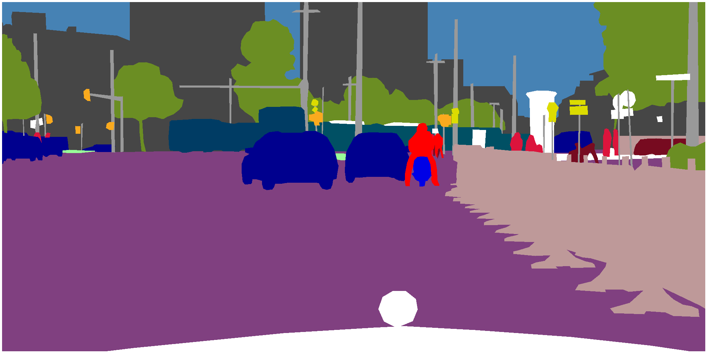

# Reward optimisation
## Rosa Sensat intership at CVC Research Journal

Tutor: Joan Serrat
Guim Casadellà Cors
04 - 2022

---
# Semantic segmentation

 
Pixel - wise classification

---

# Real datasets
## Urban environments

<div style="display: flex; justify-content: space-between;">
<div class="column" style="margin-right: 10px; width: 50%;">

**Cityscapes**
 

</div>
<div class="column" style="margin-left: 10px; width: 50%;">

**Mapillary Vistas**


</div>
</div>


---

# Real datasets

**EasyPortrait**


**Issue**: Hard and costly to annotate

---

# Synthetic datasets

 
**Ground Truth** is "**free**" to obtain

---

UDA vs ADA
===

[Unsupervised domain adaptation : **no target labels** available, do self-training]()

1. train model with *synthetic* source
1. make predictions on *real* target images
1. select "best" predictions as groundtruth = **pseudolabels**
1. retrain the model, go to 2.

[Active domain adaptation: **ask for a few target labels**]()

1. train model with *synthetic* source
1. select a few *promising*$^*$ target samples to be **annotated by a human** 
1. retrain the model
1. if annotation budget exhausted stop, else go to 2.

$^*$*promising* = with good chances to improve performance (mIoU)

---

# Optimisation of non differentiable functions

---

# Tuning computer vision models with task rewards

- Align model predictions and intended usage via **reward optimisation**.
- **REINFORCE**'s well-known **log-derivative** trick.
  - Learn $P(y|x, \theta) \rightarrow \max_{\theta} \mathbb{E}_{x \sim D} \left[ \mathbb{E}_{y \sim P(\cdot | x, \theta)} R(x, y) \right]$   

Approach:
1. Model **pretraining** with maximum-likelihood estimation.
1. Model **tuning** for the task by maximazing related reward with the **REINFORCE** algorithm.

[Tuning computer vision models with task rewards | Full paper link](https://arxiv.org/pdf/2302.08242)

---

# Monte Carlo Gradient Estimator: Log Derivative Trick

- Provides a way to **estimate** the gradient of the expected reward for a given input **x**:
  - $\nabla_{\theta} \mathbb{E}_{y \sim P} \left[ R(x, y) \right] = \mathbb{E}_{y \sim P} \left[ R(x, y) \nabla_{\theta} \log P(y|x; \theta) \right]$
- Unbiased estimate of **RHS** as an average of per-example gradients.
- Implemented in the model's **loss function**


<div style="display: flex; justify-content: space-between;">
<div class="column" style="margin-right: 10px; width: 50%;">

### MLE optimization step
```
function batch_loss(θ, x, y):
    # n is the size of a mini-batch.
    return (1/n) * Σ(log P(yᵢ'|xᵢ; θ))
end function

function step_mle(θ, x, y, α):
    G_mle := ∇θ batch_loss(θ, x, y)
    return θ + αG_mle
end function
```

</div>
<div class="column" style="margin-left: 10px; width: 50%;">

### Reaward optimization step

```
function batch_loss(θ, x, y, r):
    return (1/n) * Σ(r log P(yᵢ'|xᵢ; θ))
end function

function step_reward(θ, x, α):
    y_sample := batch_sample(θ, x)
    y_baseline := batch_sample(θ, x)
    r := R(x, y_sample) - R(x, y_baseline)
    G_r := ∇θ batch_loss(θ, x, y_sample, r)
    return θ + αG_r
end function
```

</div>
</div>

---

# Reduction of variance

- Method can suffer from **high variance** affecting the overall performance.
- Some **variance reduction** techniques include:
  - Increase the **number of samples** (batch size, nº GPUs) $V_n \propto O(\frac{1}{N})$
  - Substracting **baselines** $B$ independent to **x**. $\rightarrow  \mathbb{E}(B)=0$
  - Rolling mean?

# IMAGE OF TRAINING WITH HIGH VARIANCE

[Monte Carlo Gradient Estimation in Machine Learning | Full paper link](https://arxiv.org/pdf/1906.10652)

---

# Mean Intersection Over Union

<center>

 

</center>

- **mIoU**: Average **IoU** for each class

---

# Implementation details
- Semantic segmentation model structure (Encoder, Decode - Heads)
- Reward computation
- New loss function

---

# Experimentation
- Overview of the different degrees of freedom (Scheduler, LR, batch-size, ...)
- General implementation results ? -> Reduction of variance
- Learning rate and sheduler results
- Batch size and baseline computation
- Model structure (Auxiliary head)

---

# Results and future work


- Achievements on different datasets
- Future work