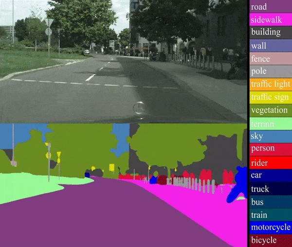
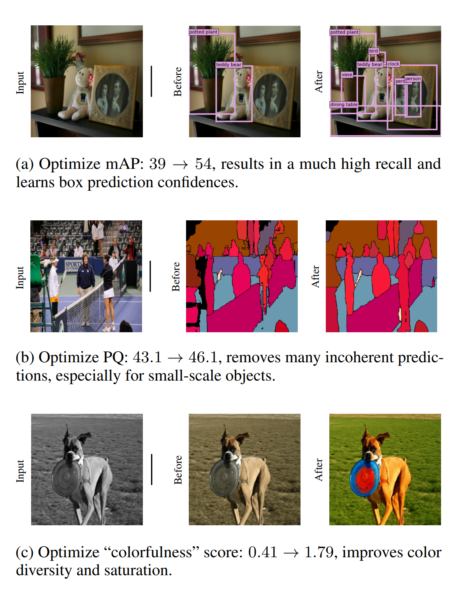

# Reward optimisation
## Rosa Sensat intership at CVC Research Journal

Tutor: Joan Serrat
Guim Casadellà Cors
04 - 2024

---
# Semantic segmentation
<div style="display: flex; justify-content: space-between;">
<div class="column" style="margin-right: 10px; width: 50%;">

<div style=" padding:60px;">

 

</div>

</div>
<div class="column" style="margin-left: 10px; width: 50%;">


</div>
</div>


**Pixel - wise classification**

---

# Real datasets
## Urban environments

<div style="display: flex; justify-content: space-between;">
<div class="column" style="margin-right: 10px; width: 50%;">

**Cityscapes**
 

</div>
<div class="column" style="margin-left: 10px; width: 50%;">

**Mapillary Vistas**


</div>
</div>


---

# Real datasets

**EasyPortrait**


**Issue**: Hard and costly to annotate

---

# Synthetic datasets

 
**Ground Truth** is "**free**" to obtain

---

UDA vs ADA
===

[Unsupervised domain adaptation : **no target labels** available, do self-training]()

1. train model with *synthetic* source
1. make predictions on *real* target images
1. select "best" predictions as groundtruth = **pseudolabels**
1. retrain the model, go to 2.

[Active domain adaptation: **ask for a few target labels**]()

1. train model with *synthetic* source
1. select a few *promising*$^*$ target samples to be **annotated by a human** 
1. retrain the model
1. if annotation budget exhausted stop, else go to 2.

$^*$*promising* = with good chances to improve performance (mIoU)


---

# Goal: Mean Intersection Over Union
<center>

 

</center>

- **mIoU**: Average **IoU** for each class

---

# Optimisation of non differentiable functions
<!-- stochastic reward function-->
---

# Tuning computer vision models with task rewards



---
# Tuning computer vision models with task rewards
## Some definitions

- $y$ and $x$ are the **groundtruth** and **input vectors**, respectively.
- Dataset of $N$ training examples, sampled from a distribution $D$.
- $\theta$ are the **parameters** describing a neural network.
- $P(y|x, \theta)$ Probability of predictiong **y** from **x** given NN is in state $\theta$.
- $R(x, y)$ is the evaluation of the **reward** function.
- $\nabla_{\theta}$ deontates the usual **gradient** computation of a NN.

---
# Tuning computer vision models with task rewards
<!-- explain the basic meanings -->
- Align model predictions and intended usage via **reward optimisation**.
- **REINFORCE**'s well-known **log-derivative** trick.
  - Learn $P(y|x, \theta) \rightarrow \max_{\theta} \mathbb{E}_{x \sim D} \left[ \mathbb{E}_{y \sim P(\cdot | x, \theta)} R(x, y) \right]$   

Approach:
1. Model **pretraining** with maximum-likelihood estimation.
1. Model **tuning** for the task by maximazing related reward with the **REINFORCE** algorithm.

[Tuning computer vision models with task rewards | Full paper link](https://arxiv.org/pdf/2302.08242)

---

# Monte Carlo Gradient Estimator: Log Derivative Trick
- Provides a way to **estimate** the gradient of the expected reward for a given input **x**:
  - $\nabla_{\theta} \mathbb{E}_{y \sim P} \left[ R(x, y) \right] = \mathbb{E}_{y \sim P} \left[ R(x, y) \nabla_{\theta} \log P(y|x; \theta) \right]$
- Unbiased estimate of **RHS** as an average of per-example gradients.
- Implemented in the model's **loss function**

---

# Loss function involving reward optimisation

<div style="display: flex; justify-content: space-between;">
<div class="column" style="margin-right: 10px; width: 50%;">

### MLE optimization step
```
function batch_loss(θ, x, y):
    # n is the size of a mini-batch.
    return (1/n) * Σ(log P(yᵢ'|xᵢ; θ))
end function

function step_mle(θ, x, y, α):
    G_mle := ∇θ batch_loss(θ, x, y)
    return θ + αG_mle
end function
```

</div>
<div class="column" style="margin-left: 10px; width: 50%;">

### Reaward optimization step

```
function batch_loss(θ, x, y, r):
    return (1/n) * Σ(r log P(yᵢ'|xᵢ; θ))
end function

function step_reward(θ, x, α):
    y_sample := batch_sample(θ, x)
    y_baseline := batch_sample(θ, x)
    r := R(x, y_sample) - R(x, y_baseline)
    G_r := ∇θ batch_loss(θ, x, y_sample, r)
    return θ + αG_r
end function
```

</div>
</div>

---

# Reduction of variance


---

# Reduction of variance

- Method can suffer from **high variance** affecting the overall performance.
- Some **variance reduction** techniques include:
  - Increase the **number of samples** (batch size, nº GPUs) $V_n \propto O(\frac{1}{N})$
  - Substracting **baselines** $B$ independent to **x**. $\rightarrow  \mathbb{E}(B)=0$
  - Rolling mean?

[Monte Carlo Gradient Estimation in Machine Learning | Full paper link](https://arxiv.org/pdf/1906.10652)

---


---


<center>


</center>

[Papers with code](https://paperswithcode.com/task/semantic-segmentation/codeless#task-home)


---

# Encoder - Decoder Structure

<center>


</center>


- **Encoder**: Feautre extractor (ResNet, ...)
- **Decoder**: 


---

# Deeplabv3

- **Widespread use** in numerous research papers
- Medium **size**: Fits inavailable GPU's memory $\le 12 GB$
- **Atrous Spatial Pyramid Pooling (ASPP)**

<center>


</center>

---

# Implementation overview

- Implemented a **custom decode head** MMsegmentation module which inherits from the **base decode head**.

- Includes **reward & baseline computation** capabilities when performing a **loss forward step** in **train** mode.

- Interacts with the new **reward optimisation loss** function.

---

# Reward and baseline computation

<div style="display: flex; justify-content: space-between;">
<div class="column" style="margin-right: 10px; width: 50%;">

### Reward

- Implemented in **MMSegmentation** as a new **Loss Function**
- $R(x_i, y_i) = 1 - \frac{\sum{IoU(x_i, y_i)}}{nº \ classes}$ to **weight better** ($loss \to 0$) when $mIoU \to 1$

</div>
<div class="column" style="margin-left: 10px; width: 50%;">

### Baseline 

- Given a **loss forward step** on $k$ batched images
  - $r_x = R(x, y)$ Vector of rewards
  - $r_b = \frac{\sum{r_x} - r_x}{k-1}$ Baseline: Rewards of **other** images
  - $r = r_x - 0.1r_b$ Reward vector fed to custom **loss function**

</div>
</div>


---

# Custom loss Implementation

<div style="display: flex; justify-content: space-between;">
<div class="column" style="margin-right: 10px; width: 50%;">

### Reaward optimization step

```
function batch_loss(θ, x, y, r):
    return (1/n) * Σ(r log P(yᵢ'|xᵢ; θ))
end function

function step_reward(θ, x, α):
    y_sample := batch_sample(θ, x)
    y_baseline := batch_sample(θ, x)
    r := R(x, y_sample) - R(x, y_baseline)
    G_r := ∇θ batch_loss(θ, x, y_sample, r)
    return θ + αG_r
end function
```

</div>
<div class="column" style="margin-left: 10px; width: 50%;">

### Implementation


```
function batch_loss(θ, x, y, r):
    return r·cross_entropy(θ, x, y)
end function
```

Where `cross_entropy` is a wrapper from **MMSegmentation** above `torch.nn.functional.cross_entropy`


</div>
</div>

---

# Experimentation


---

# Deeplav3 Progress


---

# Degrees of freedom

- Scheduler
- Model Structure
- Baseline
- Steps
- Weights

---

# Scheduler


<div style="display: flex; justify-content: space-between;">
<div class="column" style=" width: 70%;">

<center>


</center>

</div>
<div class="column" style=" width: 50%;">

- Best config: $1e-4 \rightarrow 1e-6$
- **Lower** starting learing rate **LR** to "overcome" the change in the model's structure and loss function
- Perform some **variance reduction** by also **lowering** the final **LR**


</div>
</div>


---

# Model Structure

<div style="display: flex; justify-content: space-between;">
<div class="column" style="width: 70%;">

<center>


</center>

<!--$LR: 1e-4 \rightarrow 1e-6$ -->

</div>
<div class="column" style="width: 50%;">

- Overall better performance than **original trend line**
- **Auxiliary head** roughest start beacause facing more changes
- Both face **high-variance** 


</div>
</div>

---

# Baseline


---

# Baseline


---

# Steps

---

# Weights

---

# Results and future work


- Achievements on different datasets
- Future work